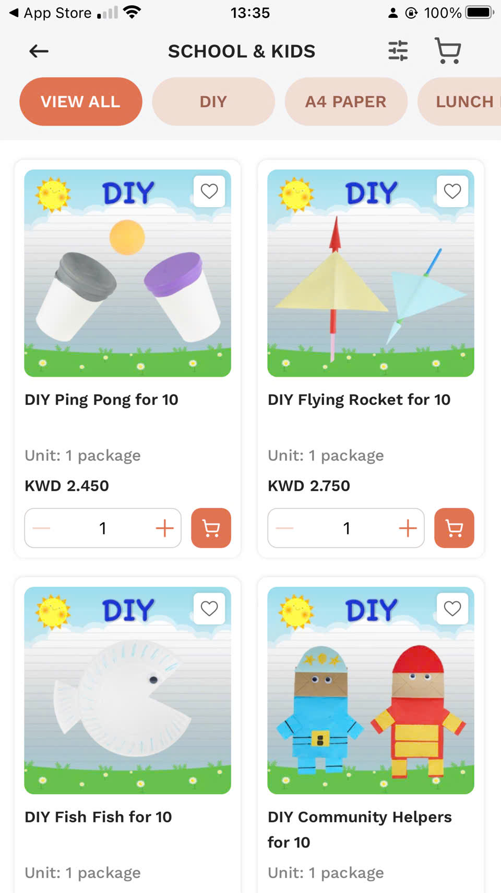
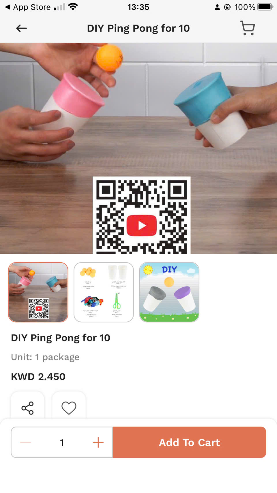

# Hi, I'm Huong 👋

Senior Flutter & React Native Engineer helping startups and ecommerce businesses build scalable, production-grade mobile applications.

5+ years experience delivering ecommerce, SaaS, Shopify, and AI-powered apps used by thousands of users.

---

# What I Specialize In

- Flutter & React Native applications
- Ecommerce mobile apps
- Shopify mobile solutions
- SaaS platforms
- AI-powered workflows & integrations
- Mobile architecture & performance optimization

---

# Featured Projects

## Ecommerce Mobile App (30k+ active users)

Production-scale Flutter ecommerce application with integrated payment gateways, shipping systems, and real-time order tracking.

### Key Contributions

- Architected scalable mobile structure for high-traffic usage
- Integrated multiple payment providers
- Optimized app performance and API synchronization
- Improved checkout and user experience

### Stack

Flutter • Firebase • REST APIs • Payment SDKs

  
  
  

---

## Shopify Mobile App Builder

Mobile solution enabling Shopify merchants to transform online stores into native mobile applications.

### Key Features

- Real-time product synchronization
- Push notifications
- Multi-store support
- Mobile-first ecommerce experience

### Stack

Flutter • Shopify APIs • Firebase • GraphQL

  
  

---

# Tech Stack

### Mobile

Flutter • React Native • Swift • Kotlin

### Frontend

React.js • Next.js • TypeScript

### Backend & Services

Node.js • Firebase • REST APIs • GraphQL

### Architecture & Tools

Clean Architecture • MVVM • CI/CD • GitHub Actions

### AI & Automation

OpenAI API • AI Workflows • Automation Systems

---

# Why Clients Work With Me

✅ Production-grade mobile applications  
✅ Clean scalable architecture  
✅ Fast communication & reliable delivery  
✅ Experience leading mobile teams  
✅ Long-term product support mindset  
✅ Focus on performance & maintainability

---

# Open Source & Engineering

I enjoy building scalable mobile systems, improving app performance, and creating reusable engineering solutions for production applications.

Currently focused on:

- Ecommerce mobile architecture
- AI-powered mobile experiences
- Scalable SaaS systems
- Mobile performance optimization

---

# Let's Build Your Mobile App

Available for:

- Flutter development
- React Native apps
- Ecommerce solutions
- Shopify mobile apps
- AI integrations
- Long-term product development

📫 Email: nguyensyhuong3010@gmail.com

💼 GitHub: https://github.com/nguyensyhuong

🌐 Portfolio: https://huong-engineering-portfolio.vercel.app/
